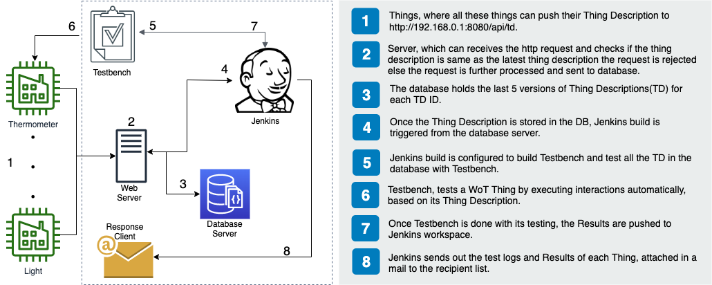

# wot-sys-ci

This tool is to developed to perform continuous integration on the wot-sys devices, once the wot-sys devices pushes their Thing Description to database.

Its not a standalone tool. Idea can be used for continuous integration in Web of Things.

Working Principle:

Requirements: 

1. Raspberry pi 4 with the 4GB RAM. - Go with the latest version if released.

2. SD Card with the minimum of 16 GB memory capacity

TODO: Vagrant box with all packages preinstalled

Device setup recreation:

1. Download Raspbian Buster with desktop. from: https://raspberrypi.org/downloads/raspbian

2. Install Raspbian using the Raspberry pi documentations. - https://www.raspberrypi.org/documentation/installation/installing-images/ - Always go with the latest release.

3. Once the OS is stored in the USB / SD Card in the bootable format, insert it into Raspberry pi and the connect the power cable. By default it should be a passwordless login. 

4. Connect to BayernWLAN. (Do not connect to any radius server, unless you have seperate user for the Raspberry pi)

5. Ethernet Config:
    1. Configure eth0 with static ip 192.168.0.100 and make sure no gateway routes are learned through it.
        - Configure the file /etc/dhcpcd.conf with the below commands
            - interface eth0
            - static ip_address=192.168.0.100/24
            - nogateway

6. Install MongoDB wihtout authentication:

    1. Install docker:
        1. Install Docker `curl -sSL https://get.docker.com | sh`
        2. Add permission to Pi User to run Docker Commands `sudo usermod -aG docker pi`
        3. Test Docker installation `docker run hello-world `
    2. Install MongoDB from docker:
        - docker build -t andresvidal/rpi3-mongodb3 .
    3. Starting MongoDB with REST enabled: (TODO: Explain what this command does)
        - docker run -d \
            --name rpi3-mongodb3 \
            --restart unless-stopped \
            -v /data/db:/data/db \
            -v /data/configdb:/data/configdb \
            -p 27017:27017 \
            -p 28017:28017 \
            andresvidal/rpi3-mongodb3:latest \
            mongod --rest
        - The above command allows to start the docker image and makes sure it restarts when the docker image moves state when it is not stopped manually. This command also 
    4. Check Docker image status:
        - docker ps or docker ps -a to see previous ones

7. Run Database Server: (Only for the first time, On reboot the server is started from the startup file)
    1. Clone this Repository
    2. Navigate to db/server
    3. npm install
    4. node wot-sys-ci/db/server/app.js & (Always run in background)
    5. Check server process using " ps -ef | grep "node" "

8. Install Jenkins:
    1. Install Java: (As Jenkins is built using java):
        - https://imagej.net/Raspberry_Pi
    2. Install Jenkins:
        - https://raspberrytips.com/install-jenkins-raspberry-pi/
        - Check installation in http://localhost:8080
    3. Jenkins installation will lead to login: Path to intial admin password.
        - sudo cat /var/lib/jenkins/secrets/initialAdminPassword

9. Configure Jenkins:
    1. Install "Email Extension Plugin"
        - Go to Manage Jenkins > Manage Plugins > click on tab Available and search for “Email Extension”
        - If you find, install it. If you don’t find it, search in Installed tab because it can be installed.
    2. Configure Email Extended:
        - Go to Manage Jenkins > Configure System > search for “Extended E-mail Notification”.
        - SMTP Server : smtp.gmail.com
        - Default user E-mail suffix : @gmail.com
        - Check the checkbox "Use SMTP Authentication"
        - User Name : xxx@gmail.com
        - Password : Create a google app password and specify it here
        - Check the Checkbox "Use SSL"
        - SMTP Port : 465
    3. Change Jenkins port from 8080 to 8081:
        - "pi" user has sudo privilages by default. 
        - Open file /etc/default/jenkins with desired editor
        - Update the port number 
            -  #HTTP_PORT=8080
                HTTP_PORT=8081
    4. Configure Jenkins build for wot-sys
        - Move to http://localhost:8081
        - Click on "New Item" at the top left-hand side of your dashboard
        - In the next screen,
            - Enter the name of the item as "wot-sys-db-automation"
            - Select Freestyle project
            - Click Okay
        - As we are triggering jenkins from code, we need not edit "General", "Source Code Management" and "Build Triggers"
        - Under "Build Environment" tab
            - Check the checkbox "Delete the workspace before build starts"
        - Under "Build" tab
            - Click on "Add build step"
            - Click on "Execute Shell" and add the below commands:
                -   rm -rf testbench
                    git clone https://github.com/MuthuramanCT/testbench.git
                    cd testbench
                    npm install
                    npm run build
                    sleep 3
                    npm start &
                    cd ..
                    rm -rf wot-sys-ci
                    git clone https://github.com/MuthuramanCT/wot-sys-ci.git
                    cd wot-sys-ci
                    npm install
                    node tester.js
                    sleep 60
                    cd ..
                    rm -rf wot-sys-ci
                    rm -rf testbench
        - Under "Post-build Actions"
            - Click on "Add post-build step"
            - Click on "Editable Email Notification"
            - Fill the ‘Editable Email Notification’ fields
                - Project Recipient List : email_id@gmail.com
                - Click the ‘Advance Settings…’ button in the ‘Editable Email Notification’ box
                - Click the ‘Add Trigger’ drop-down and select the ‘Always’ option
                - Click the ‘Save’ button
                - Click the ‘Build now’ link and check the email id after the job execution.

10. Startup script:
    1. This repository has a "startUp.sh"
    2. Run and check the startup.sh after reboot.

11. Configure Cronjob on reboot:
    1. Open crontab file "crontab -e"
    2. Add the line at the EOF - "@reboot /path/to/file"
    3. On saving and quiting the file, cronjob gets configured.
    4. Check after reboot